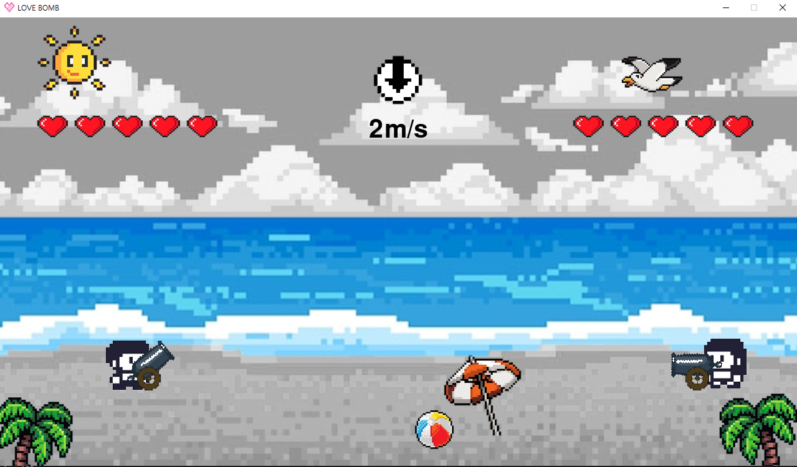

# 💞LOVE BOMB(포트리스) : 임용구, 구고운, 홍성주

## 🎮 게임 설명

포트리스 기반의 고백 공략 게임!💖 
순수한 마음을 담은 LOVE BOMB을 날려 상대방을 함락시켜라! 
사랑의 폭격을 맞아 하트 게이지가 가득차버리면 Game over! 
완전히 사랑의 노예가 되어버린다...... 
하지만 걱정하지 마라. 사랑은 이기고 지는 GAME이 아니니까 ヾ(•ω•`)o...
 
 
 
 

### 💟 MAIN & ENDING

| 시작 화면                       | 엔딩 화면                    |
| ------------------------------- | ------------------------------ | 
|  |  |

### ✔ How To Play?

| 설명 화면1                      | 설명 화면2                    |
| ------------------------------- | ------------------------------ | 
|  |  |

### 🏝 계절 구현

| 봄                              | 여름                            |
| ------------------------------- | ------------------------------ | 
|  |  |

| 가을                              | 겨울                            |
| ------------------------------- | ------------------------------ | 
|  |  |
 

### 🎲 조작법

 - 상하 방향키로 대포 각도 조절
 - 좌우 방향키로 유저 위치 조절
 - 스페이스바를 이용해 포탄 파워 조절
 
 
 

### 스크립트 제작
- 게임 설명
순수한 마음을 담은 하트 폭탄을 날려 상대방을 함락시켜라!
사랑의 폭격을 맞아 하트 게이지가 가득차버리면 Game over!
완전히 사랑의 노예가 되어버린다......

방향키를 눌러서 Love Bomb의 각도를 조절할 수 있어요.
스페이스키를 이용해 Love Bomb의 세기를 조절할 수 있어요.

Love Bomb은 계절의 영향을 많이 받는 감정 폭탄이니 유의하는 게 좋을 거예요.

- 계절 설명
<계절>
사랑의 계절, 봄 - {{기본 셋팅}} 날씨의 영향을 타지 않아요. 순수한 사랑을 전할 수 있어요.
스치기만 해도 불쾌한, 여름 - {{바람 x, 폭탄 랜덤 소멸}} 불쾌지수 10000%! 전하고 싶던 사랑 마저도 가끔은 녹아버린다는 소문이...
산책하기 좋은, 가을 - 선선한 바람이 가슴을 간지럽혀요. 폭탄에는 힘이 실리고 파괴력은 더블 업! 사랑에 쉽게 빠지는 계절이에요.
마음까지 움츠러드는, 겨울 - {{바람 저항 O, 폭탄 파괴력은 변화 X}} 한 겹 롱패딩을 뚫고 나온 사랑 폭탄의 힘이 약해져요. 평소처럼 날린다면 상대방에게 닿지 못한 마음이 될 수 있어요. 하지만, 추위마저도 이겨낸 강력한 사랑이 마침내 닿았을 때 순수한 파괴력을 가져요.
(=> 디자인 컨셉: 연애편지)

- 엔딩
(모든 경우는 <승자 - player1 // 패자 - player2> 상정)

[ 승패가 갈린 경우 ]

마침내{{ player1.playername }}의 진심이 통했다......
{{ player1.playername }}의 열렬한 구애에 {{ player2.playername }}의 철벽은 속절없이 함락당하고 말았다. 영원한 사랑의 노예가 되어버린 {{ player2.playername }}...
하지만 걱정 마라. 사랑은 이기고 지는 게 아니니까.

사랑의 주인 {{ player1.playername }}
사랑의 노예 {{ player2.playername }}

[ 비긴 경우 ] 
 턴제로 페어 플레이하기 때문에
 -1. 둘 다 동일한 턴에 하트 게이지를 다 채운 case -> 먼저 채운 쪽이 승
 -2. 둘 다 마지막 턴이 끝날 때까지 하트 게이지를 못 채운 case -> 진짜 비김

{{ player1.playername }}과 {{ player2.playername }}의 진심에는 한끗이 부족하다.
서로는 서로를 갈망했으나, 그 누구의 마음도 얻지 못했다.
이번 사랑은 저물어가지만, 괜찮다!
{{ player1.playername }}, {{ player2.playername }}는 값진 깨달음을 얻었으니까.
바로...... 사랑의 키포인트는 적극적인 애정 공세라는 사실!

